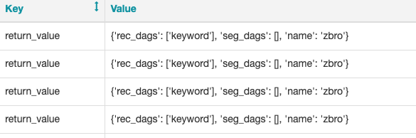
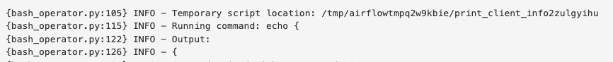

### 처음 의도

Airflow task들 끼리 변수를 전달하기 위해 xcom_pull을 통해 이전 task의 결과 값  return_value를 가져오려고 함.

그러나 DAG가 아예 사라져버린 현상을 마주했고, 아래와 같은 오류가 Airflow UI에 나타났음.

```python
Broken DAG: [../delete_serviceKey_dag.py] string indices must be integers
```


XComs에는 의도한 값이 정상적으로 잘 나오고 있었다.



```python
client_info = "{{ task_instance.xcom_pull('get_client_data', key='return_value') }}"

delete_DAG = BashOperator(
    task_id="delete_dag",
    bash_command = "airflow delete_dag {}".format(client_info["name"]),
    queue="keyword_train",
    dag=dag
)
```

위와 같이 airflow task 코드를 짜고 DAG를 돌렸을 때 return_value의 딕셔너리에 접근이 안되고 있었다.

error message에 의하면 스트링을 숫자 인덱스로 접근해야 했는데, client_info[”0”]으로 먼저 Test 해봤다.


결과는 아래와 같이 ‘{’ 문자 하나만 출력되었다.




따라서, xcom return_value는 딕셔너리로 저장되지 않고 무조건! String으로만 저장되는 것을 발견함.

```python
def get_client_info():
    serviceKey = "594a"
    
    data = open('clients.yml', encoding="utf-8")
    parsed_data = yaml.load(data, Loader=yaml.FullLoader)

    client_info = {
        "rec_dags" : [],
        "seg_dags" : [],
    }

    for type in parsed_data[serviceKey]:
        if type == "name":
            client_info["name"] = parsed_data[serviceKey]["name"]
        elif type == "purchase" or type == "rfm":
            if parsed_data[serviceKey][type]['use'] == 'Y':
                client_info["seg_dags"].append(type)
        else:
            if parsed_data[serviceKey][type]['use'] == 'Y':
                client_info["rec_dags"].append(type)

    return client_info

client_info = get_client_info()

delete_DAG = BashOperator(
    task_id="delete_dag",
    bash_command = "airflow delete_dag {}".format(client_info["name"]),
    queue="keyword_train",
    dag=dag
)
```

결론적으로 함수의 return 값 딕셔너리를 그대로 받아서 활용하는 것으로 문제를 해결함.


혹은, dag에 render_template_as_native_obj=True 파라미터 주기

https://stackoverflow.com/questions/64895696/airflow-xcom-pull-only-returns-string
