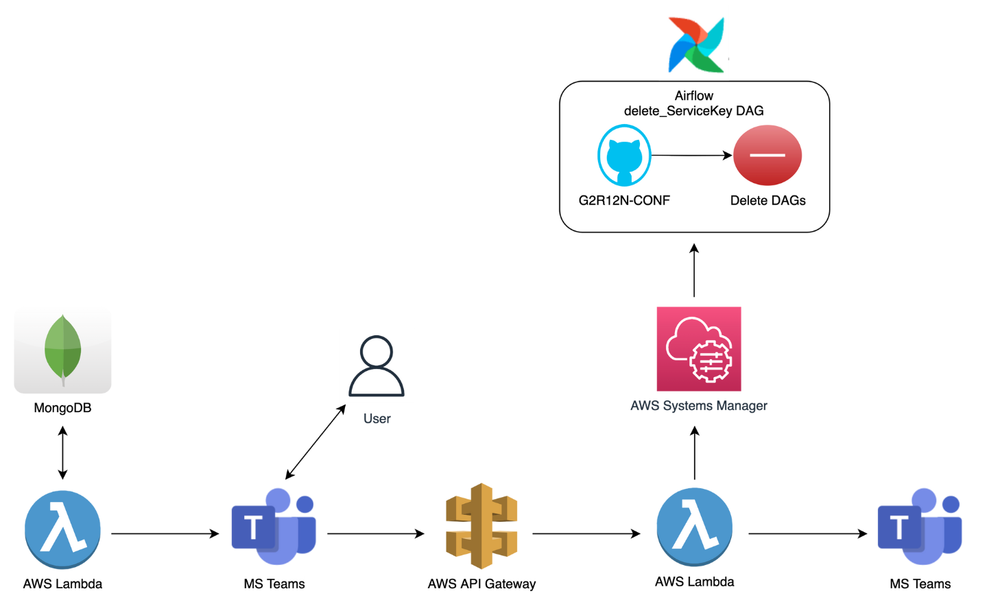

👉 AI 검색어 추천 모델 배포 실패 방지 & 수동 배포(이중 작업) 방지를 위한 파이프라인 구축

1. AWS Lambda - Teams_serviceKey_manager
   1) MongoDB에서 해지 대상 고객 (ex) 계약 만료 30일 전) info 가져오기
   2) Teams Webhook 연동 후 Actionalbe Message Card 기능으로 Teams에 알림 noti 보내기
   
2. MS Teams
   1) 해당 고객사 담당자가 Delete 버튼 클릭

3. AWS API Gateway
   1) Delete버튼에 연동되어 있는 HTTP API가 작동하고 이 API는 4번 Lambda를 호출함

4. AWS Lamba - deleteServiceKey
   1) AWS Systems Manager를 활용하여 Airflow main 서버 접속 후 delete_serviceKey DAG trigger
   2) clients.yml 파일 수정 후(고객사 삭제) git repo update
   3) 기존 생성 DAG들 삭제(rec&seg)

5. MS Teams
   1) 고객사 해지 알림 보내기
